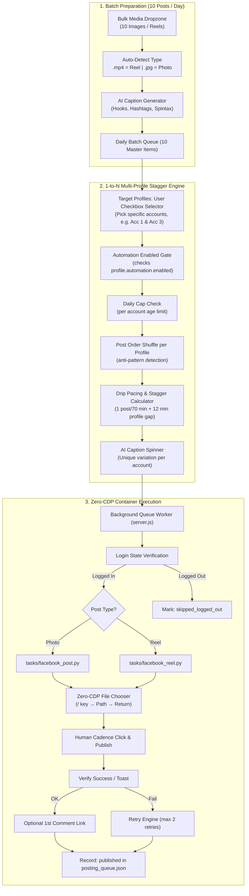
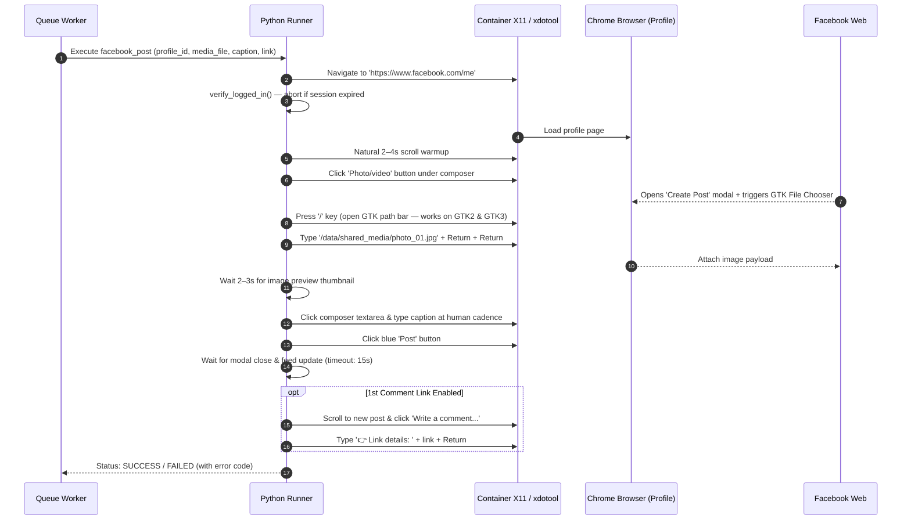
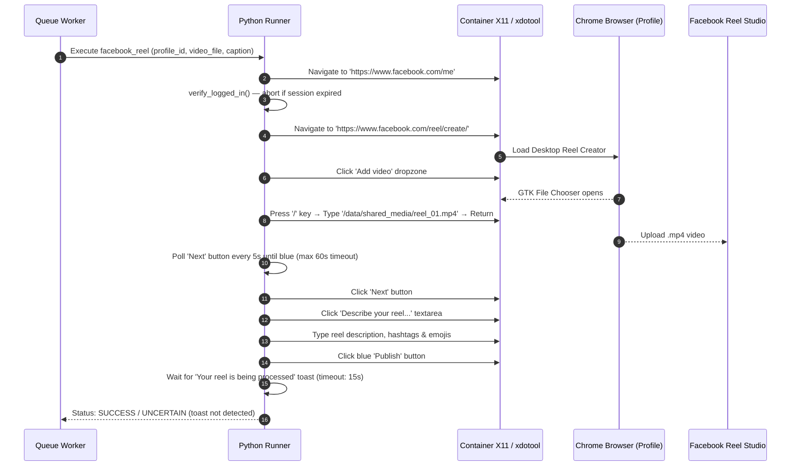

# Zero-CDP Automated Batch Posting Architecture: Photo & Reel Flow

> **Version:** 2.0  
> **Architecture:** Zero-CDP (Pure X11 & Native OS Input Dispatch)  
> **Target Platforms:** Facebook Feed Image Posts & Facebook Reels (9:16 Vertical Video)  
> **Deployment Model:** 1-to-N Multiplier (Batch 10 Posts/Day Distributed Across All Isolated Profiles)

---

## 1. System Overview

This specification details the end-to-end design for preparing and executing automated content publication across multiple isolated Facebook accounts.



---

## 2. Detailed Execution Flows

### Pre-Task: Login State Verification

Before any post task begins, verify the container's Chrome session is logged into Facebook. This prevents the script from executing against a redirected login page.

```python
def verify_logged_in(self) -> bool:
    """
    Checks for profile avatar or composer presence on facebook.com/me.
    Falls back to checking URL — if redirected to /login, session is expired.
    """
    self.client.navigate_to("https://www.facebook.com/me")
    time.sleep(random.uniform(3.0, 5.0))

    # Vision match: look for composer or profile header elements
    composer = self.vision.find_element("composer_button")
    if composer:
        return True

    # Fallback: check current URL via xdotool window title
    res = self.client.exec_cmd(["xdotool", "getactivewindow", "getwindowname"])
    if "login" in res.stdout.lower() or "log in" in res.stdout.lower():
        self.log("ERROR", "Session expired — container is at login page.")
        return False

    return True
```

---

### Flow A: Standard Image / Photo Post Flow



#### Step Details

1. **Navigate to Profile:** Uses `https://www.facebook.com/me`. Facebook redirects to the authenticated user's profile URL regardless of language or vanity URL.
2. **Login Gate:** Verify composer or profile header is visible before proceeding. Abort and mark `skipped_logged_out` if session is expired.
3. **Open Photo Composer:** Click the green `"Photo/video"` button beneath `"What's on your mind?"`.
4. **Zero-CDP File Attachment:**
   - Linux GTK File Chooser dialog opens automatically.
   - Press `/` key to activate path entry bar — more reliable than `Ctrl+L` across GTK versions.
   - Type `/data/shared_media/<file_name>` and press `Return` twice.
5. **Caption Input:** Type using human cadence (30–80ms random delays, occasional backspace corrections) or inject via `xclip`.
6. **Publish:** Click the blue `"Post"` button. Wait up to 15s for the dialog to close (image must finish uploading first).
7. **First Comment Link:** Post external URL as a comment — not in the main caption — to preserve organic reach.

---

### Flow B: Reel (9:16 Vertical Video) Post Flow

Reels require Facebook's dedicated desktop video upload pipeline for proper algorithmic indexing.



#### Step Details

1. **Login Gate:** Verify session before navigating to Reel Studio.
2. **Navigate to Reel Studio:** Open `https://www.facebook.com/reel/create/` directly. Guarantees Facebook treats it as a 9:16 Reel with full algorithmic distribution, not a regular feed video.
3. **Zero-CDP File Chooser:** Press `/` key, type full container path, press `Return`.
4. **Transcode Readiness Poll:** Poll the `"Next"` button's color every 5 seconds until it turns active blue (`#1877F2`). Maximum wait: 60 seconds. If exceeded, mark as `failed_transcode_timeout`.
5. **Description & Hashtags:** Type reel description with trending hashtags (`#reels #viral #fyp`).
6. **Publish & Verify:** Click `"Publish"`, wait up to 15s for the confirmation toast. If toast not detected, mark as `uncertain` for manual review — do not retry automatically (to avoid duplicate posts).

---

## 3. Data Structure: Content Queue Schema

The daily batch queue is persisted atomically in `data/posting_queue.json`:

```json
{
  "queue_version": "2.0",
  "daily_batches": [
    {
      "batch_id": "batch_2026_09_24",
      "name": "Daily Growth Campaign",
      "created_at": "2026-09-24T08:00:00Z",
      "target_profiles": ["profile_001", "profile_002", "profile_003"],
      "schedule_window": {
        "start_time": "09:00",
        "end_time": "21:00",
        "profile_stagger_minutes": 15
      },
      "posts": [
        {
          "post_id": "p01",
          "type": "reel",
          "media_file": "morning_habits.mp4",
          "base_caption": "3 morning habits that changed my productivity forever 🔥 #reels #focus #success",
          "first_comment": "https://productivitymastery.com/free-guide",
          "ai_spin": true,
          "executions": [
            {
              "profile_id": "profile_001",
              "scheduled_at": "2026-09-24T09:00:00Z",
              "spun_caption": "3 daily habits that doubled my output in 30 days 🚀 #reels #focus #dailyhabits",
              "status": "pending",
              "retry_count": 0,
              "error": null,
              "published_at": null
            },
            {
              "profile_id": "profile_002",
              "scheduled_at": "2026-09-24T09:15:00Z",
              "spun_caption": "If you struggle with morning consistency, do these 3 things right now 👇 #reels #discipline #mindset",
              "status": "pending",
              "retry_count": 0,
              "error": null,
              "published_at": null
            },
            {
              "profile_id": "profile_003",
              "scheduled_at": "2026-09-24T09:30:00Z",
              "spun_caption": "Stop wasting your mornings. Try these 3 habits tomorrow morning ⚡ #reels #growth #productivity",
              "status": "pending",
              "retry_count": 0,
              "error": null,
              "published_at": null
            }
          ]
        }
      ],
      "posting_order_per_profile": {
        "profile_001": [3, 7, 1, 9, 4, 6, 2, 10, 8, 5],
        "profile_002": [8, 2, 5, 1, 10, 3, 7, 4, 6, 9],
        "profile_003": [6, 4, 9, 2, 7, 1, 5, 10, 3, 8]
      }
    }
  ]
}
```

### Atomic Write Pattern (Corruption Prevention)

Never write directly to `posting_queue.json`. Always use a temporary file + atomic rename:

```js
// server.js — safe queue write
function saveQueue(data) {
  const tmpPath = QUEUE_PATH + '.tmp';
  fs.writeFileSync(tmpPath, JSON.stringify(data, null, 2), 'utf-8');
  fs.renameSync(tmpPath, QUEUE_PATH); // atomic on Linux (same filesystem)
}
```

This prevents a server crash mid-write from producing corrupted JSON and losing the daily schedule.

---

## 4. Anti-Detection & Account Protection Rules

### 1. Cross-Profile Time Staggering
- **Rule:** Never launch identical or coordinated posts across containers simultaneously.
- **Implementation:** For any given master post, profile executions are staggered by **10 to 18 minutes** with ±3 minutes of randomized jitter.

### 2. Post Order Shuffling (Per Profile, Per Day)
- **Problem:** If Profile 1, 2, and 3 always post the same 10 videos in the same sequence, Facebook's content graph detects a suspicious coordinated pattern across IPs.
- **Solution:** Generate a unique shuffled `posting_order` array for each profile at batch creation time. Each profile posts the same 10 pieces of content but in a different daily sequence.

```python
import random

def generate_posting_orders(profiles: list[str], post_count: int) -> dict:
    orders = {}
    base = list(range(1, post_count + 1))
    for profile_id in profiles:
        shuffled = base.copy()
        random.shuffle(shuffled)
        orders[profile_id] = shuffled
    return orders
```

### 3. AI Caption Variation (Auto-Spinning)
- **Problem:** Identical text from different proxies = coordinated spam flag.
- **Solution:** The AI takes the master caption and generates one unique variation per profile, with:
  - Different opening hooks (question, stat, imperative)
  - Varied emoji placement and selection
  - Shuffled hashtag order
  - Rephrased sentences (same meaning, different words)

### 4. Drip-Feed Spacing
- **Rule:** 10 posts spread across at least 10–12 active hours per profile.
- **Interval Formula:**

$$\text{Interval} = \frac{\text{End Time} - \text{Start Time}}{\text{Post Count}} \pm \text{Random Jitter (5–12 min)}$$

- Target: one post every **65 to 80 minutes**, matching an active professional creator pattern.

### 5. Daily Post Cap Per Account (Account Age Guard)

Each profile's `config.json` must include a `max_posts_per_day` field. The scheduler checks this before queuing any execution:

| Account Age | Safe Daily Post Limit |
| :--- | :--- |
| 0–30 days (warming phase) | **1–2 posts / day** |
| 30–90 days (growth phase) | **3–5 posts / day** |
| 90+ days (established) | **5–10 posts / day** |

```json
// profiles/profile_001/config.json
{
  "account": {
    "warming_week": 3,
    "max_posts_per_day": 3
  }
}
```

### 6. Selective Profile Checkbox Targeting & Global Killswitch

Not every account needs or should have automation enabled. The system provides two layers of explicit user control:

1. **Batch-Level Selective Checkbox Matrix (Campaign Builder):**
   - The user selects exactly which profiles participate in the current batch via individual checkboxes:
     - `[x] Account 1 (profile_001)` — Included
     - `[ ] Account 2 (profile_002)` — Excluded (Manual / Staging)
     - `[x] Account 3 (profile_003)` — Included
   - Quick buttons: `[Select Running Only]`, `[Select All]`, `[Clear Selection]`.
   - The batch will **only** generate executions for checked accounts.

2. **Profile-Level Global Automation Killswitch (`config.json`):**
   - Each profile can permanently disable automation to protect high-value or personal accounts from accidental batch queuing:

```json
// profiles/profile_002/config.json
{
  "automation": {
    "enabled": false,
    "max_posts_per_day": 0,
    "reason": "manual_control_only"
  }
}
```
   - If `automation.enabled === false`, the profile appears greyed out in the Batch Creator with a `🔒 Manual Only` badge and cannot be accidentally scheduled.

### 7. Zero-CDP File Chooser Emulation
- Press `/` key to trigger GTK path entry (works on GTK2 and GTK3, GNOME and XFCE).
- Generates genuine Linux kernel `evdev`/X11 synthetic events.
- Zero Chrome DevTools Protocol (CDP) signatures.

---

## 5. Retry & Failure Recovery

### Retry Table per Failure Scenario

| Failure Scenario | Status Code | Retry Behaviour |
| :--- | :--- | :--- |
| GTK file dialog didn't open | `failed_gtk` | Wait 10s, retry up to **2 times** |
| Video transcode timed out (>60s) | `failed_transcode_timeout` | Retry after 5 min (video may need longer) |
| Post/Publish button not found | `failed_no_button` | Retry with coordinate fallback estimate |
| Published but success toast not detected | `uncertain` | **No auto-retry** — mark for manual review |
| Session expired / logged out | `skipped_logged_out` | Skip profile, alert operator |
| Caption typing interrupted | `failed_caption` | Retry full task from Step 1 |

### Retry Implementation (Python)

```python
MAX_RETRIES = 2

def run_with_retry(self) -> bool:
    for attempt in range(1, MAX_RETRIES + 2):
        try:
            result = self.run()
            if result:
                return True
            self.log("WARN", f"Attempt {attempt} failed. Retrying...")
            time.sleep(10 * attempt)  # backoff: 10s, 20s
        except Exception as e:
            self.log("ERROR", f"Attempt {attempt} exception: {e}")
            time.sleep(10 * attempt)
    self.log("ERROR", "All retries exhausted. Marking as failed.")
    return False
```

---

## 6. Storage & Container Volume Mounts

A single shared media directory on the host is mounted read-only into all profile containers, eliminating file duplication:

```bash
# Host Directory (place your 10 daily media files here)
/home/rathana/Desktop/automat_fb/profiles/shared_media/

# Added to docker run in scripts/run_profile.sh
-v "/home/rathana/Desktop/automat_fb/profiles/shared_media:/data/shared_media:ro"
```

### Queue Data Storage

```bash
# Host path for daily queue persistence
/home/rathana/Desktop/automat_fb/data/posting_queue.json

# Mounted into server.js as a managed local file (not container-level)
```

### Supported Media Formats

| Type | Formats | Recommended Spec |
| :--- | :--- | :--- |
| **Image** | `.jpg`, `.jpeg`, `.png`, `.webp` | 1080×1080 (square) or 1080×1350 (portrait) |
| **Reel / Video** | `.mp4`, `.mov` | 1080×1920 (9:16 vertical), H.264, max 60s |

---

## 7. Manager App UI Architecture

### 1. Batch Creator (`BatchPostCreator.tsx`)

- **Bulk Drag-and-Drop Area:** Drop 10 files at once; rows auto-populate.
- **Type Badge:** Auto-assigned (`🎬 Reel` or `🖼️ Photo`) with manual override toggle per row.
- **Per-Row Controls:**
  - Media thumbnail preview
  - Caption text field (editable)
  - First comment URL field (optional)
  - `[ ✨ AI Spin ]` toggle — generates unique variation per profile on schedule
- **Campaign Controls:**
  - **Selective Target Profiles Matrix (Checkboxes):**
    - Individual toggles: `[x] Account 1 (Texas)` | `[ ] Account 2 (Manual)` | `[x] Account 3 (NY)`
    - Quick selection buttons: `[Select Running Only]`, `[Select All]`, `[Clear Selection]`
    - Status badges shown alongside each profile (`Running`, `Stopped`, or `🔒 Manual Only`)
    - Non-automated / manual accounts are disabled and marked with `Manual Only`
  - Time window: `Start: 09:00` → `End: 21:00`
  - Profile stagger: `15 minutes` (adjustable)
  - Computed summary: *"2 profiles selected × 10 posts = 20 scheduled executions today"*
  - Action: `[ 📅 Schedule Daily Batch ]`

### 2. Live Queue Monitor (`PostingQueuePanel.tsx`)

- Chronological timeline view of all scheduled executions for the current day.
- Real-time status badges:
  - `⏳ Pending` — waiting for scheduled time
  - `🚀 Running` — automation engine executing now
  - `✅ Published` — verified successful post
  - `❓ Uncertain` — posted but toast undetected (manual review)
  - `⚠️ Failed` — all retries exhausted
  - `🔒 Skipped` — account logged out or daily cap reached
- Per-row quick actions: `[ ▶ Post Now ]`, `[ ✏ Edit Caption ]`, `[ 🗑 Remove ]`.

---

## 8. Implementation Roadmap

| Phase | Component | Key Deliverables |
| :--- | :--- | :--- |
| **Phase 1** | **Shared Media & Task Runners** | • Create `profiles/shared_media/` + mount in `run_profile.sh`<br/>• `automation/tasks/facebook_post.py` with GTK `/` key file chooser<br/>• `automation/tasks/facebook_reel.py` with Reel Studio flow<br/>• `verify_logged_in()` pre-task gate<br/>• `run_with_retry()` wrapper |
| **Phase 2** | **Backend Queue & Stagger Engine** | • `data/posting_queue.json` atomic writer in `server.js`<br/>• REST: `GET /api/queue`, `POST /api/queue/batch`, `DELETE /api/queue/:id`<br/>• 30s background cron dispatcher<br/>• Daily cap check from `config.json`<br/>• Post order shuffle generator |
| **Phase 3** | **AI Caption & Spinning Engine** | • `POST /api/ai/spin-caption` endpoint (N unique variations per base caption)<br/>• Hashtag & emoji variation generator |
| **Phase 4** | **Frontend UI in Manager App** | • `BatchPostCreator.tsx` (10-post bulk table + drag-and-drop)<br/>• `PostingQueuePanel.tsx` (real-time execution monitor + status badges)<br/>• Integration with `CampaignsPanel.tsx` |
