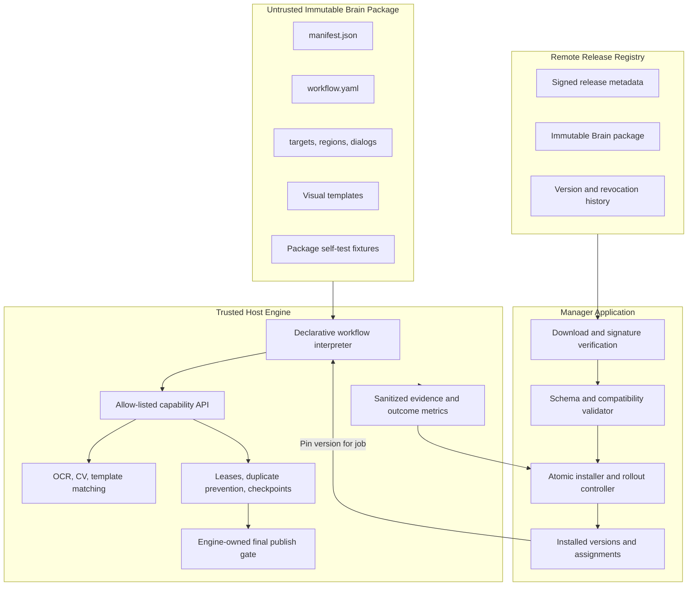
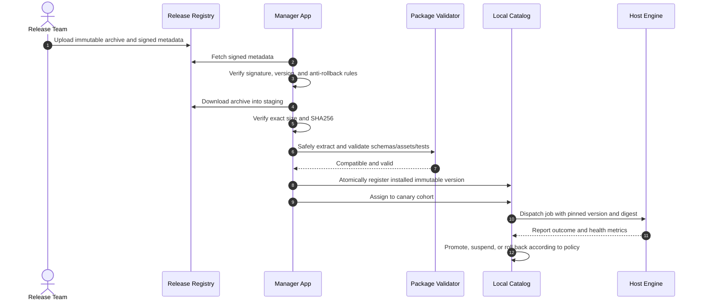

# Modular Automation Brain: Secure Workflow Model and OTA Distribution Plan

## 1. Executive Summary

### 1.1 The Challenge

In Zero-CDP visual browser automation, the application interacts with platforms such as Facebook through screenshots, OCR, visual templates, and simulated human input. A platform can break an automation workflow by changing button labels, rearranging a composer, adding a dialog, changing an icon, or placing an account into a UI experiment cohort.

Shipping a complete desktop or Docker application update for each UI change is slow and expensive:

- Full releases can be hundreds of megabytes.
- Non-technical operators may postpone application upgrades.
- Rebuilding containers and dependencies creates unnecessary downtime.
- A global update is risky when only one workflow or UI cohort has changed.

### 1.2 Proposed Solution

Separate the application into two layers:

1. **Trusted Host Engine** — the stable runtime that owns sensors, input actuators, security controls, duplicate prevention, execution state, and the final publish gate.
2. **Workflow Brain** — a small, signed, immutable, over-the-air package containing declarative states, perception rules, visual assets, and dialog policies.

When Facebook changes its interface, the team publishes a new Brain package rather than reinstalling the application. The Manager downloads it, verifies its signature and content hash, validates compatibility, installs it atomically, and deploys it first to a canary group. Jobs pin their Brain version at dispatch time, and the system can automatically suspend or roll back a faulty version.

### 1.3 Core Trust Rule

The Brain is treated as **untrusted policy input**, not as trusted executable code.

The Brain may propose actions such as finding a target, typing a caption, or requesting publication. It cannot directly access the operating system, network, filesystem, mouse driver, scheduler database, or publication actuator. Security and duplicate-prevention guarantees remain enforceable even if a Brain package is malformed or malicious.

---

## 2. Architecture and Trust Boundaries



### 2.1 Trusted Host Engine

The Host Engine changes only through a normal application release and owns:

- Docker, Chrome, Xvfb, VNC/noVNC, and process isolation.
- OCR, OpenCV, model weights, screenshot acquisition, and coordinate transforms.
- Mouse and keyboard actuators.
- Scheduler leases, job ownership, crash recovery, and execution state.
- Duplicate-publication prevention and idempotency keys.
- CAPTCHA, 2FA, account restriction, and suspension checkpoints.
- The final publish actuator and post-publication verification.
- Brain parsing, schema validation, step limits, timeouts, and resource limits.
- Sanitized telemetry, screenshots, audit events, and rollout health metrics.

### 2.2 Workflow Brain

A Brain package describes how to perform one workflow using only supported engine capabilities:

- State-machine states and allowed transitions.
- OCR labels, synonyms, confidence thresholds, and locale variants.
- Normalized search regions and viewport requirements.
- Visual templates and matching thresholds.
- Dialog recognition and approved dismissal policies.
- Timeouts, retry limits, and recovery transitions.
- Supported locales, themes, viewport families, account types, and known UI cohorts.
- Offline self-test fixtures for parser and perception validation.

### 2.3 Capability API

The workflow interpreter exposes a small, versioned set of operations. Example capabilities include:

- `observe_screen`
- `wait_for_state`
- `find_text`
- `find_template`
- `click_candidate`
- `type_text`
- `select_media`
- `dismiss_known_dialog`
- `request_publish`
- `verify_publication`
- `request_operator_review`

The Brain cannot call raw `xdotool`, arbitrary Python, shell commands, HTTP clients, filesystem APIs, database APIs, or internal engine methods.

`request_publish` is a request, not a click. The engine independently checks the lease, idempotency record, current stage, target confidence, operator policy, and valid screen state before executing the irreversible action.

### 2.4 Optional Future Extension Code

The initial implementation must not support executable Brain code. If declarative workflows later prove insufficient, extension code must run in a separate restricted process or container with:

- no host filesystem access except a read-only package mount;
- no network access;
- no environment secrets;
- CPU, memory, execution-time, and output-size limits;
- a narrow authenticated RPC interface to the capability API;
- no direct input actuator or publish access.

---

## 3. Brain Package Specification

### 3.1 Local Directory Structure

```text
brains/
├── catalog.json
├── staging/
└── facebook_post/
    ├── bundled_default/
    │   ├── manifest.json
    │   ├── workflow.yaml
    │   ├── config/
    │   ├── templates/
    │   └── tests/
    └── 2.1.0/
        ├── manifest.json
        ├── workflow.yaml
        ├── config/
        │   ├── targets.json
        │   ├── regions.json
        │   └── dialogs.json
        ├── templates/
        │   ├── composer_input.png
        │   ├── photo_icon.png
        │   └── publish_button.png
        └── tests/
            ├── fixtures.json
            └── screenshots/
```

Installed version directories are immutable. Activation is represented in the catalog or database, not by modifying package contents. A job records the exact Brain ID, version, and package digest before execution starts.

### 3.2 Manifest Schema

```json
{
  "$schema": "https://schemas.example.internal/brain-manifest-v1.json",
  "manifest_version": 1,
  "brain_api_version": 1,
  "id": "facebook_post",
  "version": "2.1.0",
  "name": "Facebook Feed Post Workflow",
  "platform": "facebook",
  "task_type": "post",
  "min_engine_version": "1.4.0",
  "max_engine_version_exclusive": "2.0.0",
  "released_at": "2026-09-26T12:00:00Z",
  "package_sha256": "<sha256-of-exact-distributed-archive>",
  "supported_locales": ["en", "es", "km"],
  "supported_themes": ["light", "dark"],
  "supported_viewports": ["desktop_standard", "desktop_wide"],
  "change_log": "Support the Share now label and updated audience dialog.",
  "rollout": {
    "recommended_canary_percent": 5,
    "minimum_sample_size": 20
  }
}
```

The package hash is stored in signed registry metadata. If it is duplicated inside `manifest.json`, both values must agree. The signature is over canonical release metadata containing the Brain ID, version, digest, size, compatibility range, release time, and revocation status.

### 3.3 Declarative Workflow Example

```yaml
schema_version: 1
brain_api_version: 1
workflow_id: facebook_post

limits:
  max_steps: 60
  max_runtime_seconds: 300
  max_recovery_attempts: 3

initial_state: feed_ready

states:
  feed_ready:
    require:
      any:
        - text_target: feed_marker
        - template_target: facebook_home
    actions:
      - capability: click_candidate
        target: composer_entry
    on_success: composer_open
    on_timeout: operator_review

  composer_open:
    require:
      all:
        - text_target: composer_heading
        - region_visible: composer_dialog
    actions:
      - capability: select_media
        input: media_path
        when: media_present
      - capability: type_text
        target: caption_input
        input: caption
    on_success: wait_ready
    on_known_dialog: handle_dialog
    on_timeout: safe_abort

  wait_ready:
    require:
      all:
        - target_enabled: publish_button
        - upload_complete: true
    actions:
      - capability: request_publish
        target: publish_button
    on_success: verify_publication
    on_rejected: operator_review

  verify_publication:
    actions:
      - capability: verify_publication
    on_success: completed
    on_uncertain: uncertain
```

### 3.4 Schema and Semantic Validation

Before installation or activation, the Manager must reject a package that:

- uses an unknown schema or Brain API version;
- requests an unsupported capability;
- contains unreachable states or invalid transitions;
- lacks terminal handling for timeout, rejection, or uncertain outcomes;
- exceeds configured file-count, archive-size, or extracted-size limits;
- contains undeclared files or mismatched hashes;
- contains invalid image formats or unreasonable dimensions;
- declares an incompatible engine range;
- fails bundled offline self-tests.

---

## 4. Execution Model and Safety Invariants

### 4.1 Version Resolution and Pinning

At dispatch time, the Manager resolves the Brain version using this precedence:

1. Explicit version assigned to the job.
2. Version assigned to the profile or canary cohort.
3. Globally active stable version.
4. Bundled default when no compatible installed version is available.

The resolved version and SHA256 digest are written to the job record before execution. A running or retried job always uses that pinned version unless an operator explicitly creates a new attempt with a different version.

This prevents an OTA update from changing workflow behavior halfway through a job or between crash recovery attempts.

### 4.2 Engine-Owned State Machine

The Host Engine owns authoritative execution stages such as:

```text
queued
  -> leased
  -> preparing
  -> editing
  -> ready_to_publish
  -> publish_authorized
  -> publish_clicked
  -> verifying
  -> completed | failed_safe | uncertain | operator_review
```

Brain states provide workflow detail but cannot overwrite or skip authoritative engine stages.

### 4.3 Irreversible Action Boundary

Before executing a publish request, the engine must confirm:

- the job still owns a valid scheduler lease;
- no successful or uncertain publication exists for the idempotency key;
- the job is in `ready_to_publish`;
- the detected target meets the configured confidence and region rules;
- no CAPTCHA, 2FA, restriction, or suspension screen is present;
- the profile and rollout policy authorize this Brain version;
- the current observation is recent enough to act upon.

After the input event is sent, any crash, timeout, or ambiguous result becomes `uncertain`. It must never trigger an automatic publication retry.

### 4.4 Input Validation

The engine validates all proposed actions:

- Coordinates must fall within the permitted browser viewport and target region.
- Observations expire after a short interval to prevent stale clicks.
- Target confidence must meet engine-enforced minimums.
- Text length and media paths must match the job's authorized inputs.
- Step count, retries, runtime, and dialog loops are bounded.
- Unexpected privileged requests produce `operator_review`, not fallback execution.

---

## 5. Secure OTA Distribution

### 5.1 Release Trust Model

Use an offline-protected Ed25519 release-signing key. The desktop application ships with the corresponding public verification key. The registry may use GitHub Releases, S3, or an API service, but registry transport is not the root of trust.

Signed metadata should include:

- Brain ID and version;
- exact archive digest and byte size;
- engine and Brain API compatibility;
- release timestamp and optional expiration;
- rollout channel (`canary`, `stable`, or `revoked`);
- monotonically increasing metadata version;
- key ID and signature.

Key rotation should be supported through a desktop application release or a metadata format that requires authorization from an already trusted key.

### 5.2 Installation Flow



### 5.3 Safe Extraction Requirements

The installer downloads into a unique staging directory and must reject:

- absolute paths, `..` path segments, and path normalization escapes;
- symbolic links, hard links, devices, FIFOs, and sockets;
- duplicate paths and case-collision paths;
- excessive file count, archive size, extracted size, or compression ratio;
- executable binaries and unapproved file extensions;
- files not declared in package metadata.

After validation, the installer uses an atomic rename into `brains/<id>/<version>/`. The catalog is updated through an atomic file replacement or database transaction. Interrupted installations remain only in staging and are cleaned up safely later.

### 5.4 Anti-Downgrade and Revocation

The Manager tracks the highest trusted metadata version it has seen and rejects older registry metadata unless an operator deliberately performs an offline recovery. A signed revocation record prevents new jobs from using a compromised Brain version while preserving its audit history.

### 5.5 Offline Behavior

If the registry is unreachable:

- continue using the last verified compatible stable Brain;
- do not erase or replace installed versions;
- expose update status without blocking normal jobs;
- fall back to the bundled default only when policy and compatibility allow it;
- never bypass signature or compatibility validation for a manual package.

---

## 6. Rollout, Canary, and Automatic Rollback

### 6.1 Assignment Levels

The system supports assignments at these levels:

- explicit job override;
- profile assignment;
- named canary cohort;
- percentage-based canary cohort;
- global stable version.

Assignment should be deterministic so the same profile remains in the same cohort during evaluation.

### 6.2 Health Metrics

Compare the candidate Brain with the current stable version using:

- completed-job rate;
- safe-failure rate;
- uncertain-publication rate;
- operator-review rate;
- median and tail execution duration;
- timeout and recovery-loop frequency;
- target-confidence distribution;
- unexpected-dialog and unknown-screen frequency.

Metrics must be segmented by locale, viewport, theme, account type, and detected UI cohort where sample size permits.

### 6.3 Rollout States

```text
installed -> validating -> canary -> stable
                    |          |
                    v          v
                 rejected   suspended -> rolled_back
```

Example policy:

- Start with one internal test profile.
- Expand to 5% after offline and live smoke tests pass.
- Promote after a minimum sample size and an acceptable comparison with stable.
- Suspend automatically if uncertain outcomes, checkpoint detections, or failures exceed defined thresholds.
- Roll back future assignments atomically; already running jobs retain their pinned version.

Automatic rollback must never cause an uncertain job to retry publishing.

---

## 7. Observability and Diagnostic Evidence

Each job should record a structured event for every meaningful state transition:

- job ID, profile ID pseudonym, engine version, Brain ID/version/digest;
- authoritative engine stage and Brain state;
- observation timestamp and viewport metadata;
- selected target, matching method, confidence, and normalized region;
- requested capability and engine decision;
- timeout, recovery, dialog, or checkpoint reason;
- sanitized screenshot or crop when policy permits;
- final outcome and publication-verification evidence.

Logs and screenshots must redact captions, account identifiers, access tokens, cookies, private messages, and unrelated page content. Evidence retention must be configurable.

A small replay tool should be able to run a Brain's perception rules against stored sanitized screenshots without issuing input events. This enables rapid regression testing when Facebook changes its UI.

---

## 8. Manager Backend API

Recommended endpoints:

1. **`GET /api/brains`**  
   Return installed versions, compatibility, rollout state, assignments, and trusted remote availability.

2. **`POST /api/brains/check`**  
   Fetch and verify signed release metadata without installing anything.

3. **`POST /api/brains/install`**  
   Download, verify, safely extract, validate, self-test, and atomically register a version.

4. **`POST /api/brains/assign`**  
   Assign a validated version to a profile, cohort, percentage, or stable channel.

5. **`POST /api/brains/promote`**  
   Promote a healthy canary version to stable.

6. **`POST /api/brains/suspend`**  
   Prevent new jobs from using a problematic or revoked version.

7. **`POST /api/brains/rollback`**  
   Atomically restore future assignments to the previous healthy version.

8. **`GET /api/brains/:id/:version/health`**  
   Return outcome metrics segmented by relevant UI dimensions.

Mutating endpoints require local authentication, authorization, CSRF protection where applicable, and audit logging. The server must derive package URLs from verified registry metadata rather than accepting arbitrary URLs from clients.

---

## 9. Manager UI

The Manager application should provide:

### 9.1 Brain Status Card

- Active stable and canary versions.
- Engine and Brain API compatibility.
- Package signature and verification status.
- Release date, digest abbreviation, and release notes.
- Profiles and jobs currently assigned to each version.

### 9.2 Update Flow

- Check for signed updates.
- Show compatibility and release notes.
- Install without activating.
- Run offline self-tests.
- Assign to a test profile or canary cohort.
- Promote only after showing health evidence.

### 9.3 Rollback and Suspension

- One-click suspension for new jobs.
- One-click rollback to the previous healthy stable version.
- Clear warning that running jobs remain pinned.
- Separate handling for jobs in `uncertain` or `operator_review`.

### 9.4 Diagnostic View

- Timeline of states and capability decisions.
- Sanitized screenshot evidence.
- Target confidence and matching method.
- Filters for Brain version, locale, viewport, theme, and outcome.

---

## 10. Implementation Roadmap

The estimates below distinguish a functional prototype from production hardening. They should be refined after inspecting the current engine and test coverage.

| Phase | Milestone | Key Deliverables | Indicative Effort |
| :---: | :--- | :--- | :---: |
| **0** | Contract and Threat Model | Trust boundaries, Brain API v1, authoritative engine stages, package and registry schemas, failure semantics | 2–4 days |
| **1** | Local Declarative Runtime | Workflow parser/interpreter, allow-listed capabilities, pinned versions, bundled default conversion, unit tests | 4–7 days |
| **2** | Safety Boundary | Engine-owned publish gate, stale-observation protection, resource limits, uncertain-state tests, adversarial Brain tests | 4–7 days |
| **3** | Signed Package Pipeline | Ed25519 signing, canonical metadata, safe extractor, atomic installation, compatibility/self-tests, key handling | 4–7 days |
| **4** | Manager API and UI | Catalog, assignments, install/check/promote/suspend/rollback APIs, status and diagnostic UI | 5–8 days |
| **5** | Telemetry and Replay | Structured events, redaction, screenshot fixtures, offline perception replay, health aggregation | 4–7 days |
| **6** | Canary Rollout | Deterministic cohorts, health thresholds, automatic suspension/rollback, live validation | 4–7 days |
| **7** | Production Hardening | Crash and concurrency tests, interrupted-update recovery, revocation, offline recovery, operational runbooks | 5–10 days |

A narrow local prototype may be possible in approximately one week. A production-ready OTA system should be planned as a multi-week effort, depending on existing infrastructure and test maturity.

---

## 11. Testing Strategy

### 11.1 Unit and Schema Tests

- Valid and invalid manifests and workflows.
- Unknown capabilities and API versions.
- Unreachable states, infinite loops, and missing terminal transitions.
- Version compatibility and assignment precedence.
- Signature, digest, expiration, downgrade, and revocation checks.

### 11.2 Archive Security Tests

- Path traversal and absolute paths.
- Symlink, hard-link, device, FIFO, and socket entries.
- Zip/tar bombs and excessive file counts.
- Duplicate names, Unicode normalization, and case collisions.
- Interrupted download, extraction, validation, and catalog update.

### 11.3 Safety Tests

- Malformed Brain attempts to bypass required states.
- Publish request without a lease or idempotency record.
- Stale screenshot coordinates.
- Crash before, during, and after the publish input event.
- Verification timeout after publish becomes `uncertain` without retry.
- CAPTCHA, 2FA, suspension, and unknown checkpoint detection.

### 11.4 Rollout Tests

- Deterministic cohort assignment.
- Stable and canary jobs running concurrently.
- Rollback while jobs are running.
- Automatic suspension at health thresholds.
- Preservation of pinned versions during retry and recovery.

---

## 12. Definition of Done

The architecture is complete when all of the following are demonstrated:

1. A Facebook UI change can be addressed through a small signed Brain package without rebuilding the desktop application or Docker image.
2. The application verifies signature, digest, compatibility, schema, archive safety, and self-tests before installation.
3. A malicious or malformed Brain cannot access raw input actuators, the network, host files, scheduler state, or the final publish operation.
4. Every job records and retains its exact Brain version and digest from dispatch through completion.
5. Brain activation and rollback are atomic, and running jobs remain pinned to their original version.
6. Any ambiguous outcome after the publish boundary becomes `uncertain` and never retries automatically.
7. Canary health is measurable against stable and can automatically suspend or roll back a bad release for future jobs.
8. Operators can diagnose failures using structured, sanitized evidence and offline screenshot replay.
9. Offline operation safely uses the last verified compatible version without weakening trust checks.
10. Key rotation, release revocation, recovery procedures, and operational ownership are documented and tested.

---

## 13. Recommended First Delivery Slice

Build the smallest end-to-end vertical slice before implementing the complete OTA interface:

1. Define Brain API v1 and the authoritative engine state machine.
2. Convert the existing Facebook post flow into `workflow.yaml` plus target configuration.
3. Implement only the capabilities required by that workflow.
4. Enforce the engine-owned publish gate and pinned version record.
5. Add offline screenshot fixtures and a no-input replay test.
6. Package one local version, validate it, and switch versions atomically.
7. Prove that malformed workflows cannot bypass safety checks.
8. Add signed remote distribution only after the local trust boundary is working.

This order validates the most important architectural claim—the safety boundary—before investing in release hosting and management UI.
