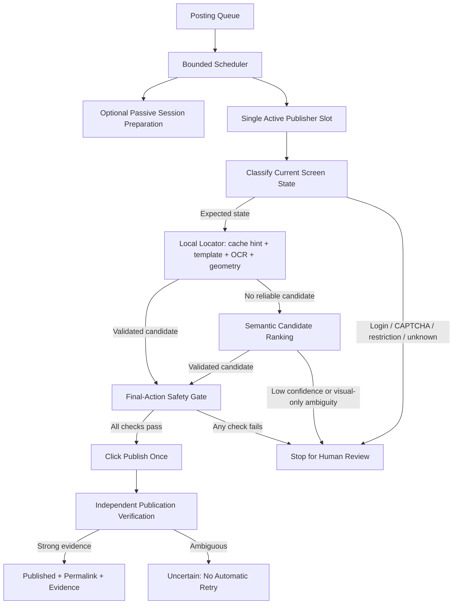
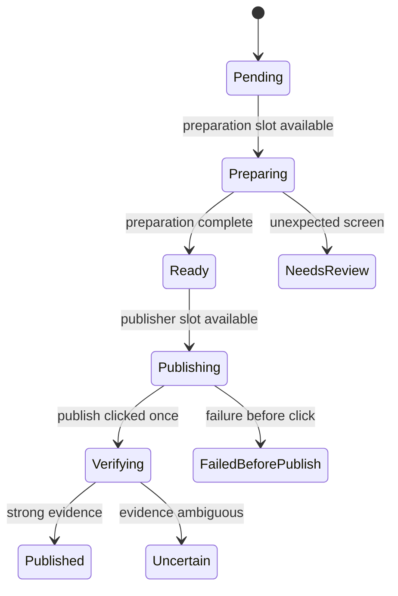

# Facebook Automation: Reliability, Safety & Optimization Plan

This roadmap focuses on deterministic correctness, evidence-backed verification,
bounded resource use, and authorized operation. Timing variation and passive
browsing are treated as optional experiments—not guarantees that an account is
safe or that automation is indistinguishable from a person.

All performance and success-rate targets in this document must be validated with
local measurements before they are presented as achieved results.

---

## 1. Engineering Principles

1. **Prevent duplicate publication.** A final publish action is sent at most once.
   Ambiguous outcomes remain `uncertain` until a person or independent evidence
   resolves them.
2. **Prefer deterministic local decisions.** Templates, OCR, geometry, color, and
   explicit screen-state checks run before any external semantic service.
3. **Use AI as an adviser, not an unchecked actuator.** A semantic model may rank
   candidates, but it cannot independently authorize the final Publish click.
4. **Stop on checkpoints.** Login prompts, account restrictions, CAPTCHA, consent
   dialogs, and other unexpected states require human review.
5. **Cache hints, not truth.** Cached labels and positions must be revalidated
   against the current screenshot before use.
6. **Measure before optimizing.** Latency, confidence, failure state, and fallback
   usage are recorded per step and per profile.
7. **Operate only authorized profiles and content.** Scheduling and concurrency
   controls exist for operational reliability, not to evade platform enforcement.

---

## 2. Target Architecture



### Required safety invariant

Once an execution reaches `publish_clicked`, no automatic or one-click retry may
start another publication attempt. The execution must first be resolved as:

- `published`, using independent evidence or manual confirmation;
- `not_published`, using reliable negative evidence; or
- `uncertain`, awaiting explicit human review.

---

## 3. Phase 0 — Correctness Baseline and Duplicate Prevention

> **Goal:** Make the current workflow safe to evaluate before adding more
> concurrency or adaptive behavior.

### 3.1 Explicit execution state machine

Use these persisted states rather than inferring safety only from process exit
codes:

1. `pending`
2. `preparing`
3. `composing`
4. `ready_to_publish`
5. `publish_clicked`
6. `verifying`
7. `published`
8. `failed_before_publish`
9. `uncertain`
10. `needs_review`

Record state transitions atomically with timestamps. A process crash after
`publish_clicked` must resolve to `uncertain`, never `failed_before_publish`.

### 3.2 Fix uncertain-result handling

- Remove the direct rerun action from `uncertain` rows in
  `PostingQueuePanel.tsx`.
- Replace it with **Review on Facebook** and **Resolve outcome** actions.
- Allow a new attempt only after the operator explicitly resolves the previous
  execution as `not_published`.
- Retain the existing rule that an ambiguous final click is never automatically
  retried.

### 3.3 Establish baseline telemetry

For each execution, record:

- time spent in navigation, OCR, upload, publish readiness, and verification;
- locator tier used for every action;
- OCR confidence and candidate count;
- screen dimensions, browser zoom, locale, and theme where available;
- final-action evidence and state transitions;
- fallback reason, human-review reason, and external API latency/cost;
- outcome: published, failed before publish, uncertain, or needs review.

### 3.4 Baseline acceptance criteria

Run a representative test set before Phase 1 and record the actual values for:

- duplicate-publication rate;
- confirmed-publication rate;
- uncertain rate;
- median and p95 execution time;
- OCR latency by region and full screen;
- human-intervention rate.

Do not assign percentage improvements until these measurements exist.

---

## 4. Phase 1 — Permalink and Evidence Correlation

> **Goal:** Associate a confirmed Facebook URL and durable evidence with the exact
> execution that created it.

### 4.1 Identify the created post safely

Do not assume the first or newest visible post is the one just created. Correlate
using multiple available signals:

- a normalized fragment of the submitted caption;
- media type and a local media fingerprint;
- publication time window;
- visible author/profile identity;
- post/reel type;
- publication confirmation captured immediately after the final click.

Pinned posts, delayed feed ordering, simultaneous activity, and duplicate captions
must be treated as ambiguity.

### 4.2 Extract and validate the permalink

Preferred visual workflow:

1. Locate the correlated post card.
2. Open its timestamp or equivalent post-detail link.
3. Read the resulting browser address through the existing OS-level workflow.
4. Validate that the URL uses an allowed Facebook host and recognized post/reel
   path shape.
5. Store it only when correlation confidence passes the configured threshold.

If URL extraction or correlation is ambiguous, retain the screenshot evidence and
leave `post_url` empty rather than attaching a possibly unrelated URL.

### 4.3 Queue and dashboard changes

Add the following optional fields to each execution:

```json
{
  "post_url": null,
  "post_url_verified_at": null,
  "post_match_confidence": null,
  "evidence_dir": null,
  "review_status": null,
  "review_note": null
}
```

In `PostingQueuePanel.tsx`:

- show **Open on Facebook** only for a validated `post_url`;
- show **Review evidence** for `uncertain` and `needs_review`;
- clearly distinguish `failed_before_publish` from `uncertain`;
- require an explicit resolution before creating a replacement execution.

---

## 5. Phase 2 — Measured Local Vision Optimization

> **Goal:** Reduce vision latency without weakening state validation.

### 5.1 Adaptive region-constrained OCR

The vision engine already supports cropped OCR. Replace hard-coded 1920×1080
coordinates with normalized regions derived from the current screenshot:

| Screen purpose | Initial normalized search area |
| --- | --- |
| Bottom action bar | `x=0.00–1.00, y=0.68–1.00` |
| Modal header and alerts | `x=0.18–0.82, y=0.03–0.30` |
| Reel settings/sidebar | `x=0.58–1.00, y=0.10–1.00` |
| Profile post stream | `x=0.12–0.88, y=0.20–1.00` |

Each locator should:

1. scan its expected region;
2. expand to a larger region if the result is absent or low-confidence;
3. use a full-screen scan only as a measured fallback;
4. report the region, duration, and result confidence.

Tune these regions using captured evidence from supported resolutions, zoom levels,
themes, and locales.

### 5.2 Local locator cascade

Use the following order:

1. **Validated cache hint:** Search near the previous normalized location, then
   confirm the expected visual/text signature.
2. **Template and visual signature:** Match stable icons, geometry, enabled state,
   and color with tolerance for theme and rendering differences.
3. **OCR candidate scan:** Extract visible labels with confidence and bounds.
4. **Expanded-region retry:** Repeat locally before invoking a semantic service.

### 5.3 Cache design

Continue using the existing per-profile `element_cache.json`, but store contextual
metadata with each hint:

```json
{
  "reel_publish": {
    "labels": ["publish", "share to feed"],
    "normalized_center": [0.74, 0.89],
    "screen_size": [1920, 1080],
    "locale": "en",
    "theme": "light",
    "last_verified_at": "2026-09-25T00:00:00Z",
    "success_count": 1,
    "failure_count": 0
  }
}
```

- Treat cached positions only as search hints.
- Apply a TTL and invalidate after repeated validation failures.
- Write cache files atomically.
- Do not mix cache data into the profile's operational `config.json`.

### 5.4 Backend tuning

- Keep warning suppression narrowly scoped to known non-actionable warnings.
- Benchmark `torch.set_num_threads()` at 1, 2, and 4 threads on the deployment
  host; do not assume four is optimal.
- Warm the OCR model once per long-lived worker where architecture permits.
- Measure CPU, memory, and p95 OCR latency before and after each change.

---

## 6. Phase 3 — Guarded Semantic Fallback

> **Goal:** Handle text variations without allowing an external model to make an
> unchecked destructive or irreversible UI decision.

### 6.1 Tier A: semantic text ranking

When local matching cannot identify a known label, send a minimal structured list
of OCR candidates—not a screenshot—along with the expected screen state and goal.

Example request:

```json
{
  "state": "reel_ready_to_publish",
  "goal": "identify the publish action",
  "candidates": [
    {"id": "c1", "text": "Back", "region": "bottom"},
    {"id": "c2", "text": "Share to feed", "region": "bottom"},
    {"id": "c3", "text": "Discard", "region": "bottom"}
  ]
}
```

Require schema-constrained output containing a candidate ID, confidence, and short
reason. Reject responses that invent labels or coordinates.

### 6.2 Deterministic validation after semantic ranking

A semantic match is only a proposal. Before any click, confirm:

- the proposed candidate still exists in a fresh screenshot;
- OCR bounds map to the expected action region;
- the current state is still `ready_to_publish`;
- the button appears enabled;
- no login, restriction, CAPTCHA, error, or confirmation dialog is visible;
- confidence meets a threshold established during evaluation.

For the final Publish action, a failed check must produce `needs_review`.

### 6.3 Screenshot-based semantic analysis

Full-screenshot analysis may classify an unfamiliar screen or suggest candidate
regions, but it must not directly return an executable click for:

- CAPTCHA or account verification;
- login or credential prompts;
- consent and permission dialogs;
- delete/discard actions;
- the final Publish action without deterministic local confirmation.

Redact or crop unrelated personal information before sending images externally.
Record which images were transmitted, the provider/model identifier, latency, and
the reason for invoking the service.

### 6.4 Shadow-mode rollout

Before enabling semantic suggestions:

1. Run the fallback in shadow mode without clicking.
2. Compare suggestions with known outcomes or operator decisions.
3. Measure precision separately for each screen state and locale.
4. Enable automatic use only for reversible navigation actions that meet the
   agreed threshold.
5. Keep irreversible actions behind the final-action safety gate.

Model names, prices, and latency expectations belong in runtime configuration and
benchmark reports, not as fixed promises in this plan.

---

## 7. Phase 4 — Bounded Scheduler and Optional Session Preparation

> **Goal:** Control resource contention and queue timing with an explicit,
> observable scheduler.

### 7.1 Global concurrency controls

The dispatcher needs global limits in addition to its existing per-profile lock:

- `max_publishers = 1` initially;
- `max_preparers = 1` initially;
- `max_total_automation_tasks = 2`;
- only one active task per profile;
- a lease/heartbeat so crashed workers do not hold a slot forever.

Containers that are merely running are not equivalent to active automation jobs.
The semaphore must cover worker processes and CPU/memory-heavy stages.

### 7.2 Scheduler state model



Use atomic claims or leases so two dispatcher ticks cannot launch the same
execution. Add graceful shutdown behavior and recovery of stale `preparing` or
`publishing` leases.

### 7.3 Optional passive session preparation

Session preparation may load Facebook, wait for the page to stabilize, and perform
limited passive navigation. It must be:

- optional and disabled by default until evaluated;
- configurable by a duration range, not marketed as a proven “sweet spot”;
- skipped when the current authenticated session is already active and stable;
- aborted on login, restriction, consent, or CAPTCHA screens;
- measured for its effect on latency and outcomes.

Suggested UI choices:

- **Off:** proceed after normal state validation;
- **Brief:** short stabilization period;
- **Extended:** longer stabilization for operator-selected troubleshooting.

Do not label a preset “safe” or claim that cursor movement prevents enforcement.

### 7.4 Scheduling variation

Optional schedule variation may reduce simultaneous resource and network bursts.
Expose it as an operational setting with the exact resulting schedule visible to
the user. It must not be described as making accounts independent or defeating
platform correlation.

---

## 8. Phase 5 — Controlled Profile Provisioning and Scaling

> **Goal:** Add authorized profiles reproducibly only after reliability targets are
> met on the initial profile set.

### 8.1 Provisioning helper

Provide a validated helper such as:

```text
scripts/provision_profile.sh <profile_id> <vnc_port> <novnc_port> [proxy_reference]
```

The helper should:

- reject duplicate IDs and occupied ports;
- create directories with least-privilege permissions;
- write configuration atomically;
- reference secrets through protected environment/config storage rather than CLI
  output or logs;
- verify container health and display reachability;
- roll back partial provisioning on failure;
- never copy cookies or credentials between profiles.

### 8.2 Scaling gates

Increase concurrency or profile count only when the previous stage meets agreed
targets for a representative observation window:

- zero known duplicate publications;
- an acceptable uncertain and human-review rate;
- stable p95 execution time;
- acceptable CPU and memory headroom;
- no unresolved worker leases or queue corruption;
- permalink correlation precision at the agreed threshold.

Scale one variable at a time: first profile count, then preparation concurrency,
and only then publisher concurrency if there is a demonstrated need.

---

## 9. Testing Strategy

### 9.1 Unit tests

- normalized-region conversion and bounds clipping;
- screen-state classification;
- candidate normalization and semantic response schema validation;
- cache TTL, invalidation, and atomic writes;
- execution state-transition rules;
- URL allowlist and permalink parsing;
- scheduler leases and concurrency limits.

### 9.2 Fixture-based visual tests

Maintain sanitized screenshots for:

- light and dark themes;
- supported resolutions and zoom levels;
- post and reel flows;
- disabled and enabled buttons;
- publication success, error, login, restriction, and CAPTCHA states;
- localized labels where supported;
- pinned posts and ambiguous profile-feed ordering.

Tests should assert both correct matches and correct refusal to act.

### 9.3 Integration and failure-injection tests

- terminate the runner before and after the final click;
- delay Facebook responses and uploads;
- return malformed or low-confidence semantic output;
- change resolution between cache creation and use;
- run multiple due queue items concurrently;
- make the permalink unavailable after an otherwise confirmed publication;
- restart the manager while a lease is active.

### 9.4 Manual canary rollout

Use a small authorized test set. Review evidence for every execution during the
initial rollout, then widen gradually. Keep rollback switches for semantic fallback,
session preparation, and scheduler concurrency.

---

## 10. Recommended Work Sequence

| Priority | Workstream | Primary value | Exit condition |
| --- | --- | --- | --- |
| **P0** | State machine and uncertain-result UI | Prevent duplicate posts | No direct retry after final-click ambiguity |
| **P1** | Baseline telemetry and fixtures | Establish measurable behavior | Baseline report covers latency and all outcome classes |
| **P2** | Permalink and evidence correlation | Verifiable execution history | Validated URL or explicit unresolved state |
| **P3** | Adaptive local OCR and cache hardening | Faster, safer localization | Benchmarks show improvement without accuracy regression |
| **P4** | Semantic fallback in shadow mode | Evaluate resilience to label changes | Precision measured per state; refusal behavior verified |
| **P5** | Global scheduler and optional preparation | Bounded resource use | Concurrency and crash-recovery tests pass |
| **P6** | Controlled provisioning and scaling | Reproducible growth | Reliability and resource gates remain satisfied |

---

## 11. Definition of Done

This roadmap is complete when:

- every irreversible action is protected by an explicit state and safety gate;
- no ambiguous final click can be automatically or accidentally rerun;
- every completed execution has durable evidence and, when obtainable, a validated
  permalink;
- vision fallbacks are benchmarked and fail closed on low confidence;
- CAPTCHA, authentication, restriction, and unknown states stop for review;
- caches are contextual, expiring, atomic, and revalidated;
- dispatcher concurrency is globally bounded and recoverable after crashes;
- scaling decisions are based on measured quality and resource headroom;
- documentation reports observed metrics rather than unsupported safety claims.
