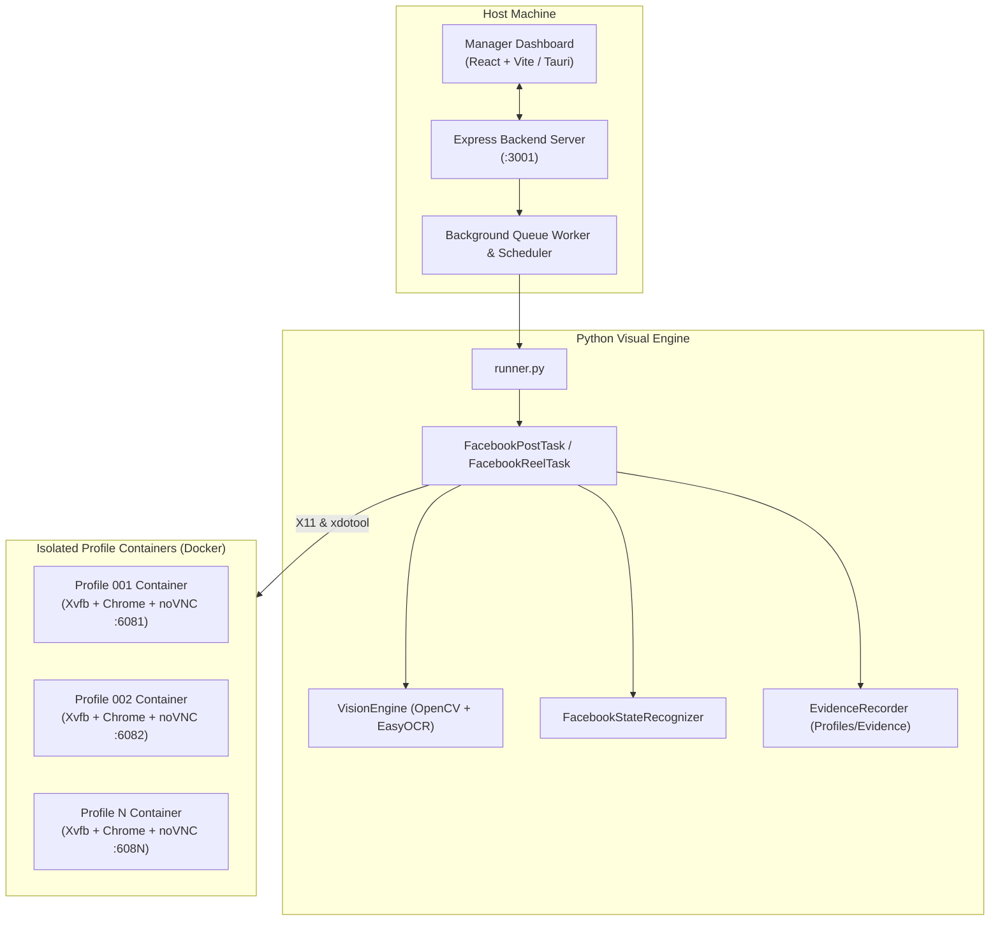

# Anti-Bot Browser: Zero-CDP Multi-Profile Automation Framework

[](https://www.docker.com/)
[](https://www.python.org/)
[](https://reactjs.org/)
[](https://vitejs.dev/)
[](https://opencv.org/)
[](https://github.com/JaidedAI/EasyOCR)
[](#)

A production-grade, anti-detection browser automation system engineered for scale. Built specifically to bypass modern anti-bot systems (such as Meta's Integrity heuristics) by eliminating Chrome DevTools Protocol (`CDP`) entirely in favor of **pure OS-level input dispatch, containerized profile isolation, and computer vision state verification**.

---

## 🚀 Key Architectural Pillars

### 1. Zero-CDP Input Dispatch
Traditional frameworks (Puppeteer, Playwright, Selenium) hook into the browser using Chrome DevTools Protocol (`Runtime.enable`, synthetic JavaScript DOM events, injected scripts). Modern anti-bot systems detect these hooks instantly.
* **Pure X11 Events:** Inputs are dispatched via `xdotool` and native X11 kernel/server events.
* **Human-like Dynamics:** Mouse movement follows randomized cubic Bézier curves with natural acceleration/deceleration. Typing mimics human cadence (30–80ms variable delays, micro-hesitations).
* **Native OS File Chooser Attachment:** Bypasses DOM `input[type="file"]` entirely. Interacts directly with Linux's GTK file chooser via keyboard navigation (`/` path shortcut).

### 2. Guarded Visual State Machine
Instead of relying on fragile, obfuscated CSS class names (`x1i10hfl xjbqb8w`) or blind `sleep()` timeouts:
* **Hybrid 3-Tier Localization:** Uses coordinate caching, OpenCV template matching, and signature HSV color masking (e.g. Facebook `#45BD62` green camera icon and `#0866FF` primary blue action buttons).
* **EasyOCR Deep Learning:** Offline OCR recognition for dynamic text and modal verification.
* **Pre/Post Structural Similarity (`SSIM`):** Compares screenshots before and after clicking publish to confirm modal closure and feed return.
* **Strict "Uncertain" Contract:** If a publish button was clicked once but confirmation is ambiguous, the task exits with code `2` (`uncertain`) and **never auto-retries blindly**, preventing accidental duplicate posts.

### 3. Containerized Profile Isolation
* Each profile runs in its own dedicated Docker container with an independent X11 virtual display (`Xvfb`), audio, font stack, and TigerVNC/noVNC server.
* **100% Proxy Tunneling:** All network traffic routes through dedicated residential SOCKS5 proxies per container.
* **Fingerprint Decoupling:** Hardware concurrency, WebGL vendor/renderer, screen resolution, and user agents are individualized per profile.

---

## 📊 System Architecture



---

## 🛠️ Supported Automation Workflows

| Task | Description | Verification Method |
| :--- | :--- | :--- |
| **Feed Image / Photo Post** | Automates single/multi-image feed posts with custom caption and emojis. Supports 2-step Facebook modals (`Next` ➔ `Post review` ➔ `Publish`). | Visual state machine (`POST_ENABLED` ➔ `FEED_READY` via SSIM). |
| **9:16 Vertical Reel** | Desktop Reel Studio creation (`/reel/create/`), video dropzone attachment, and video transcode readiness polling. | Polling enabled blue `Next`/`Publish` actions + toast detection. |
| **Organic 1st Comment Link** | Navigates to user profile (`/me`), identifies top post card, and submits destination link as comment. | OCR `"Comment as"` field detection + single-submission lock. |
| **Feed Warming** | Simulates natural human browsing, feed reading, and randomized scrolling. | Randomized Bézier cursor movement and scroll deltas. |

---

## 📁 Repository Structure

```
├── automation/                 # Python Zero-CDP Visual Automation Engine
│   ├── engine/
│   │   ├── container_client.py # Docker X11 / xdotool / scrot bridge
│   │   ├── evidence.py         # Screenshot & diagnostic JSON recorder
│   │   ├── human_input.py      # Bézier curves, natural typing, xclip
│   │   ├── screen_state.py     # Facebook visual state machine & OCR signals
│   │   └── vision.py           # Multi-tier CV (Cache, Template, HSV, EasyOCR)
│   ├── models/easyocr/         # Pretrained OCR weights (CRAFT + CRNN)
│   ├── tasks/                  # Task definitions (Post, Reel, Warming, Comment)
│   ├── templates/              # OpenCV visual templates (icons, buttons)
│   ├── tests/                  # Offline unit test suite (17 tests)
│   ├── requirements.txt        # Python dependencies
│   └── runner.py               # CLI task dispatcher
├── container/                  # Docker container definitions
│   ├── Dockerfile              # Ubuntu 22.04 + Chrome + Xvfb + TigerVNC + tun2socks
│   ├── entrypoint.sh           # Container init script
│   └── fonts.conf              # Font rendering optimizations
├── manager-app/                # Management Dashboard
│   ├── src/                    # React frontend (VNC viewer, queue, profiles)
│   ├── server.js               # Express API backend & queue runner
│   ├── proxyManager.js         # SOCKS5 proxy pool manager
│   └── package.json            # Node.js dependencies
├── profiles/                   # Profile definitions & evidence storage
│   ├── config.example.json     # Sample profile configuration
│   └── <profile_id>/           # Profile-specific data (ignored by git)
├── proxies/                    # Proxy pool configuration
│   └── proxy_pool.example.json # Sample proxy pool definition
└── scripts/                    # Helper shell scripts (build, run)
```

---

## ⚡ Getting Started

### 1. Prerequisites
* **Docker Engine** with Docker Compose
* **Node.js** (v18+) & `npm`
* **Python** (3.10+ / 3.12 recommended)
* Host OS: Linux or Windows (WSL2)

### 2. Container Image Build
Build the isolated Chrome container base image:
```bash
bash scripts/build_container.sh
```
*(Creates the `isolated-chrome:latest` local image)*

### 3. Setup Python Automation Engine
Create a virtual environment and install dependencies:
```bash
cd automation
python3 -m venv venv
source venv/bin/activate
pip install -r requirements.txt
```

Run the offline visual verification test suite:
```bash
python3 -m unittest discover -s tests
# Ran 17 tests in 0.018s -> OK
```

### 4. Setup Manager Application
```bash
cd manager-app
npm install
npm run build
```

Start the management server:
```bash
node server.js
```
* Backend API: `http://localhost:3001`
* Frontend Dashboard: `http://localhost:5173` (or run `npm run dev`)

---

## ⚙️ Configuration

### Configuring a Profile
Copy `profiles/config.example.json` into a profile directory (e.g. `profiles/profile_001/config.json`):
```json
{
  "id": "profile_001",
  "name": "Primary Account",
  "status": "stopped",
  "network": {
    "proxy_type": "socks5",
    "proxy_host": "192.168.1.100",
    "proxy_port": 1080,
    "proxy_user": "username",
    "proxy_pass": "password"
  },
  "container": {
    "vnc_port": 5901,
    "ws_port": 6081,
    "volume_path": "profiles/profile_001/chrome_data"
  }
}
```

### Configuring Proxies
Copy `proxies/proxy_pool.example.json` to `proxies/proxy_pool.json` to manage rotating SOCKS5 residential proxies.

---

## 🔒 Security & Anti-Leak Safeguards

The project is pre-configured with a strict [`.gitignore`](file:///home/rathana/Desktop/automat_fb/.gitignore) to ensure sensitive operational data is never committed to source control:
* **Browser Cookies & Storage:** Excludes all `profiles/*/chrome_data/` directories.
* **Credentials:** Excludes active `proxy_pool.json` and profile `config.json` files.
* **Evidence:** Diagnostic screenshots and JSON metadata under `automation_evidence/` remain local.

---

## 📜 License

This project is licensed under the MIT License.
