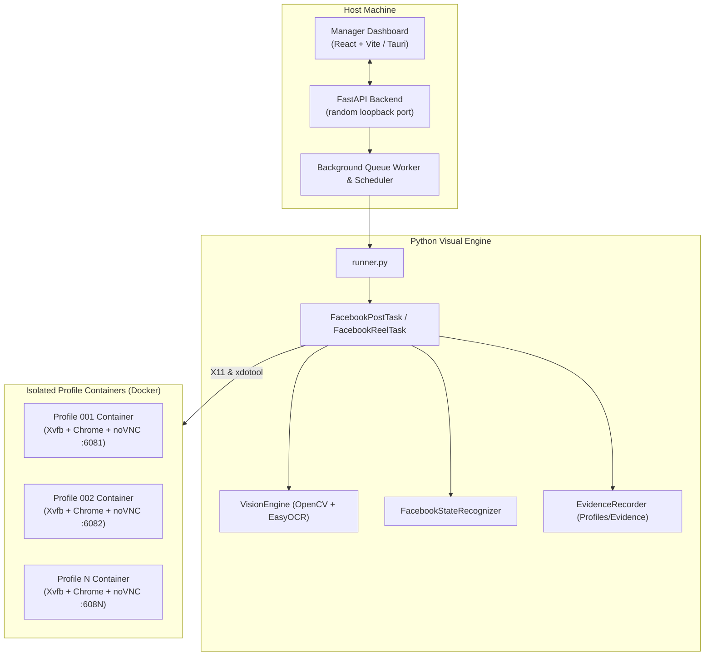

# Anti-Bot Browser: Zero-CDP Multi-Profile Automation Framework

[](https://www.docker.com/)
[](https://www.python.org/)
[](https://reactjs.org/)
[](https://vitejs.dev/)
[](https://opencv.org/)
[](https://github.com/JaidedAI/EasyOCR)
[](#)

A production-grade, anti-detection browser automation system engineered for scale. Built specifically to bypass modern anti-bot systems (such as Meta's Integrity heuristics) by eliminating Chrome DevTools Protocol (`CDP`) entirely in favor of **pure OS-level input dispatch, containerized profile isolation, and computer vision state verification**.

---

## 🚀 Key Architectural Pillars

### 1. Zero-CDP Input Dispatch
Traditional frameworks (Puppeteer, Playwright, Selenium) hook into the browser using Chrome DevTools Protocol (`Runtime.enable`, synthetic JavaScript DOM events, injected scripts). Modern anti-bot systems detect these hooks instantly.
* **Pure X11 Events:** Inputs are dispatched via `xdotool` and native X11 kernel/server events.
* **Human-like Dynamics:** Mouse movement follows randomized cubic Bézier curves with natural acceleration/deceleration. Typing mimics human cadence (30–80ms variable delays, micro-hesitations).
* **Native OS File Chooser Attachment:** Bypasses DOM `input[type="file"]` entirely. Interacts directly with Linux's GTK file chooser via keyboard navigation (`/` path shortcut).

### 2. Guarded Visual State Machine
Instead of relying on fragile, obfuscated CSS class names (`x1i10hfl xjbqb8w`) or blind `sleep()` timeouts:
* **Hybrid 3-Tier Localization:** Uses coordinate caching, OpenCV template matching, and signature HSV color masking (e.g. Facebook `#45BD62` green camera icon and `#0866FF` primary blue action buttons).
* **EasyOCR Deep Learning:** Offline OCR recognition for dynamic text and modal verification.
* **Pre/Post Structural Similarity (`SSIM`):** Compares screenshots before and after clicking publish to confirm modal closure and feed return.
* **Strict "Uncertain" Contract:** If a publish button was clicked once but confirmation is ambiguous, the task exits with code `2` (`uncertain`) and **never auto-retries blindly**, preventing accidental duplicate posts.

### 3. Containerized Profile Isolation
* Each profile runs in its own dedicated Docker container with an independent Xvfb display, x11vnc server, and noVNC web viewer.
* Viewer ports are published on host loopback only; they are not exposed to the LAN.
* **100% Proxy Tunneling:** All network traffic routes through dedicated residential SOCKS5 proxies per container.
* **Verified Browser Environment:** Profiles store requested settings separately from the effective container launch and observed runtime values. The UI does not claim that hardware or WebGL values are changed unless they are measured.

### 4. Evidence-Backed Execution Telemetry
* Every new execution writes `telemetry.json` beside its screenshots under `profiles/<id>/automation_evidence/<run_id>/`.
* Measurements include total and stage duration, navigation/upload/readiness/verification timing, OCR latency and candidate counts, locator tiers and fallback reasons, semantic-provider latency, and available screen/locale/theme context.
* The queue dashboard calculates observed outcome rates plus median and p95 execution/OCR latency. It shows an empty baseline until measured executions exist; no performance target is presented as achieved without local runs.

---

## 📊 System Architecture


```mermaid
flowchart TD
    subgraph Host["Host Machine"]
        ManagerApp["Manager Dashboard<br/>(React + Vite / Tauri)"]
        Backend["FastAPI Backend<br/>(random loopback port)"]
        QueueWorker["Background Queue Worker & Scheduler"]
    end

    subgraph Automation["Python Visual Engine"]
        Runner["runner.py"]
        Vision["VisionEngine (OpenCV + EasyOCR)"]
        Recognizer["FacebookStateRecognizer"]
        Evidence["EvidenceRecorder (Profiles/Evidence)"]
        Tasks["FacebookPostTask / FacebookReelTask"]
    end

    subgraph Containers["Isolated Profile Containers (Docker)"]
        Profile1["Profile 001 Container<br/>(Xvfb + Chrome + noVNC :6081)"]
        Profile2["Profile 002 Container<br/>(Xvfb + Chrome + noVNC :6082)"]
        ProfileN["Profile N Container<br/>(Xvfb + Chrome + noVNC :608N)"]
    end

    ManagerApp <--> Backend
    Backend --> QueueWorker
    QueueWorker --> Runner
    Runner --> Tasks
    Tasks --> Vision
    Tasks --> Recognizer
    Tasks --> Evidence
    Tasks -- "X11 & xdotool" --> Containers
```

---

## 🛠️ Supported Automation Workflows

| Task | Description | Verification Method |
| :--- | :--- | :--- |
| **Feed Image / Photo Post** | Automates single/multi-image feed posts with custom caption and emojis. Supports 2-step Facebook modals (`Next` ➔ `Post review` ➔ `Publish`). | Visual state machine (`POST_ENABLED` ➔ `FEED_READY` via SSIM). |
| **9:16 Vertical Reel** | Desktop Reel Studio creation (`/reel/create/`), video dropzone attachment, and video transcode readiness polling. | Polling enabled blue `Next`/`Publish` actions + toast detection. |
| **Organic 1st Comment Link** | Navigates to user profile (`/me`), identifies top post card, and submits destination link as comment. | OCR `"Comment as"` field detection + single-submission lock. |
| **Feed Warming** | Simulates natural human browsing, feed reading, and randomized scrolling. | Randomized Bézier cursor movement and scroll deltas. |

---

## 📁 Repository Structure

```
├── automation/                 # Python Zero-CDP Visual Automation Engine
│   ├── engine/
│   │   ├── container_client.py # Docker X11 / xdotool / scrot bridge
│   │   ├── evidence.py         # Screenshot & diagnostic JSON recorder
│   │   ├── human_input.py      # Bézier curves, natural typing, xclip
│   │   ├── screen_state.py     # Facebook visual state machine & OCR signals
│   │   ├── telemetry.py        # Bounded timing, OCR, locator & environment metrics
│   │   └── vision.py           # Multi-tier CV (Cache, Template, HSV, EasyOCR)
│   ├── models/easyocr/         # Pretrained OCR weights (CRAFT + CRNN)
│   ├── tasks/                  # Task definitions (Post, Reel, Warming, Comment)
│   ├── templates/              # OpenCV visual templates (icons, buttons)
│   ├── tests/                  # Offline reliability and safety test suite
│   ├── requirements.txt        # Python dependencies
│   └── runner.py               # CLI task dispatcher
├── container/                  # Docker container definitions
│   ├── Dockerfile              # Ubuntu 22.04 + Chrome + Xvfb + TigerVNC + tun2socks
│   ├── entrypoint.sh           # Container init script
│   └── fonts.conf              # Font rendering optimizations
├── manager-app/                # Management Dashboard
│   ├── src/                    # React frontend (VNC viewer, queue, profiles)
│   ├── src-tauri/              # Optional desktop shell
│   └── package.json            # Frontend scripts and dependencies
├── backend/                    # FastAPI API, scheduler, and profile lifecycle
│   ├── routers/                # Validated REST endpoints
│   ├── services/               # Containers, proxies, queues, and profiles
│   └── main.py                 # FastAPI application entry point
├── profiles/                   # Profile definitions & evidence storage
│   ├── config.example.json     # Sample profile configuration
│   └── <profile_id>/           # Profile-specific data (ignored by git)
├── proxies/                    # Proxy pool configuration
│   └── proxy_pool.example.json # Sample proxy pool definition
└── scripts/                    # Helper shell scripts (build, run)
```

---

## ⚡ Getting Started

### 1. Prerequisites
* **Docker Engine** with Docker Compose
* **Node.js** (v18+) & `npm`
* **Python** (3.10+ / 3.12 recommended)
* Host OS: Linux or Windows (WSL2)

On Windows, `install-windows.ps1` detects physical RAM and recommends a WSL2
memory ceiling. The default choice is 50% for hosts below 24 GB and 75% for
hosts with 24 GB or more (for example, 24 GB on a 32 GB machine). Existing
`.wslconfig` memory settings are preserved. Use `-KeepWslDefaults` to retain
Microsoft's default policy or `-WslMemoryGB <GB>` for an explicit unattended
choice. Applying a new limit restarts WSL during setup.

The desktop Install/Repair action also installs the Mesa diagnostics and
drivers used by browser acceleration. Profile startup supports native Linux
`/dev/dri` devices and the WSL2 `/dev/dxg` bridge. `host_gpu` is the default;
if the requested device or libraries are unavailable, the container starts
with software rendering and records the fallback reason instead of claiming
hardware acceleration. Native Linux uses ANGLE's Vulkan backend so Chrome can
render through the DRM device even though the private Xvfb display has a
software-only GLX renderer.

Each Chrome start first visits a loopback-only diagnostic page. It records the
browser-visible user agent, Client Hints, language, timezone, screen values,
CPU and memory values, automation flag, and WebGL renderer without CDP or
external requests, then continues to the requested start URL. The Profile
Inspector shows these observed values and uses Chrome's WebGL result—not the
container's GLX result—to determine the effective rendering mode.

The manager starts one loopback-only OCR worker and keeps the selected
EasyOCR model warm for all automation processes. GPU requests are serialized
through that worker so concurrent profiles share one CUDA model allocation
instead of loading a separate copy per process. Each automation process keeps
its existing local OCR fallback if the shared worker is unavailable.

The desktop manager also starts its API on a fresh random `127.0.0.1` port
for every app launch. A fresh session token is delivered to the embedded
frontend through Tauri IPC and is required by every API and shared-media
request. The service is therefore unreachable from the LAN and unusable by
ordinary local HTTP clients that do not belong to the running app session.

### 2. Container Image Build
Build the isolated Chrome container base image:
```bash
bash scripts/build_container.sh
```
*(Creates the `isolated-chrome:latest` local image)*

### 3. Setup Python Automation Engine
Create a virtual environment and install dependencies:
```bash
cd automation
python3 -m venv venv
source venv/bin/activate
pip install -r requirements.txt
```

Run the offline visual verification test suite:
```bash
python3 -m unittest discover -s tests
```

### 4. Setup Manager Application
```bash
cd manager-app
npm install
npm run build
```

Start the backend and development dashboard:
```bash
cd manager-app
npm start
```
* Backend API: `http://localhost:8000`
* Frontend Dashboard: `http://localhost:5173`

---

## ⚙️ Configuration

### Profile lifecycle

Create profiles through the dashboard or `POST /api/profiles`. The backend owns
profile IDs, display ports, proxy reservations, and atomic configuration writes.
Network intent is explicit, so a direct profile can never silently acquire a
pool proxy:

```json
{
  "name": "Primary Account",
  "network": {
    "mode": "direct"
  },
  "requested_environment": {
    "screen_resolution": "1920x1080",
    "timezone_policy": "host",
    "timezone": "America/Guatemala",
    "language": "en-US",
    "user_agent_policy": "browser_default",
    "user_agent": null,
    "rendering_mode": "host_gpu"
  },
  "resources": {
    "cpu_limit": 4,
    "memory_mb": 4096
  }
}
```

Resource limits default to 4 vCPU and 4 GiB per profile. They are ceilings, not
reservations, and can be changed when creating or editing a profile. At startup
the manager records the Docker-applied limits alongside an
`effective_environment` snapshot and bounded
container observations. Runtime-sensitive edits set `restart_required` until
the profile is stopped and started again. Legacy profiles are migrated to
the current schema with a versioned `config.json.v*.bak` backup; browser data is untouched.

### Configuring Proxies
Copy `proxies/proxy_pool.example.json` to `proxies/proxy_pool.json` to manage rotating SOCKS5 residential proxies.

### Guarded Semantic Fallback

Semantic candidate ranking is in shadow mode by default. It receives only local
OCR labels and candidate IDs, then records its proposal without clicking. A
proposal must be found again on a fresh screenshot, remain in the expected
region, match the expected screen state, and have an enabled visual action.
Final Post/Publish actions always remain behind the manual review gate.

Runtime controls:

```bash
SEMANTIC_FALLBACK_PROVIDER=heuristic       # heuristic, gemini, or openai
SEMANTIC_FALLBACK_SHADOW_MODE=true         # keep true during evaluation
SEMANTIC_FALLBACK_MIN_CONFIDENCE=0.80
SEMANTIC_FALLBACK_MODEL=<provider-model>   # only for an external provider
```

The queue dashboard reports shadow proposals, deterministic validation rate,
fresh-label confirmations, blocked clicks, and provider latency. These are
evaluation metrics, not permission to enable automatic publishing.

Replay saved evidence without opening or controlling a browser:

```bash
python3 automation/evaluate_semantic_shadow.py --max-per-scenario 3
```

The latest balanced report is written to
`automation/reports/semantic_shadow_latest.json`. Offline replay measures
ranking against recorded targets; temporal freshness still requires passive or
normal-run shadow observations.

### Bounded Scheduler

Scheduled automation uses persisted, heartbeat-backed leases. Defaults permit
one publisher, one optional passive preparer, and two total automation workers.
Only one task may hold a lease for a profile. Lease IDs are fencing tokens, so a
stale process cannot overwrite the outcome of a newer claim. Expired work is
recovered using the persisted execution stage: pre-publish interruptions fail
before publish, while post-click interruptions become `uncertain`.

Resource Mode is configured from the Posting Queue dashboard and persisted in
`data/manager_settings.json`. Auto selects the lowest tier supported by both RAM
and CPU: Low uses 1 publisher + 1 preparer (2 containers), Medium uses 2 + 2
(4 containers), and High uses 3 + 3 (6 containers). New container starts pause
at 80% RAM until usage falls below 70%, pause at 85% sustained CPU, and are
spaced by at least 10 seconds. Mode changes affect only new claims and never
interrupt active tasks. Lease timing remains configurable when needed:

```bash
AUTOMATION_LEASE_TTL_MS=60000
AUTOMATION_HEARTBEAT_INTERVAL_MS=15000
```

Feed Warming settings are available in Campaign → Instant Multi-Runner and in
single-profile automation. Choose fixed depth or a random cycle range (1–30),
reading pace, and news feed, own profile, or a random surface. Optional rereading,
longer pauses, cursor movement, and a final upward scroll vary passive browsing.
New sessions default to 3–8 cycles with a 180-second browsing limit; existing
queued sessions keep their fixed depth. The limit excludes authentication and
page loading, and an input action already in progress can finish after it.
Sessions report actual scroll actions and browsing duration. Warming does not
like, comment, or send messages.

Batch session preparation uses a rolling resource-mode pipeline. Brief mode
browses for 40–55 seconds and Extended mode for 55–70 seconds. Preparation
starts the next profile only when capacity is available, verifies authentication
and theme, scrolls without likes/reactions/comments, returns to the top, and
keeps that profile ready while the current profile publishes. Profile order is
shuffled once per batch and persisted across restarts. After every terminal
publish outcome, the report is saved before the profile container is stopped.
The queue exposes the persisted flow
`pending → preparing → ready → running → verifying → published`, with at most
one publisher, one preparer, and two active profile containers by default.

---

## 🔒 Security & Anti-Leak Safeguards

The project is pre-configured with a strict [`.gitignore`](.gitignore) to ensure sensitive operational data is never committed to source control:
* **Browser Cookies & Storage:** Excludes all `profiles/*/chrome_data/` directories.
* **Credentials:** Excludes active `proxy_pool.json` and profile `config.json` files.
* **Evidence:** Diagnostic screenshots and JSON metadata under `automation_evidence/` remain local.

---

## 📜 License

This project is licensed under the MIT License.
